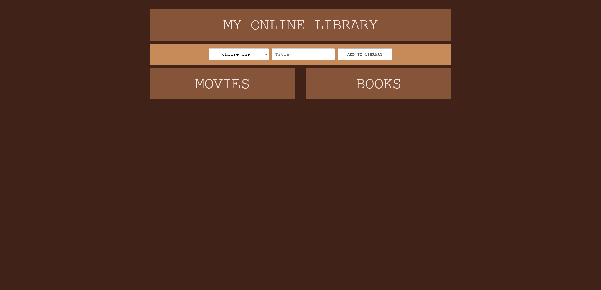

## Project 1

- [x] Use a CSS framework other than Bootstrap.
- [x] Be deployed to GitHub Pages.
- [x] Be interactive (i.e., accept and respond to user input).
- [x] Use at least two server-side APIs.
- [x] Does not use alerts, confirms, or prompts (use modals).
- [x] Use client-side storage to store persistent data.
- [x] Be responsive.
- [x] Have a polished UI.
- [x] Have a clean repository that meets quality coding standards (file structure, naming conventions, follows best practices for class/id naming conventions, indentation, quality comments, etc.).
- [x] Have a quality README (with unique name, description, technologies used, screenshot, and link to deployed application).

## User Story

As a user:

I want to be able to to make a list of my books and movies so that I can always refer back to it later.

## Description

## Technologies used

CSS framework: Skeleton
Jquery

## Screenshots of project

## Group Members

Arturo Arce
https://github.com/aarce96

Ellie Huhta
https://github.com/ehuhta

Madelane Sadia
https://github.com/msadia27

Garen Demirdogen
https://github.com/Garendemirdogen

## Github Repository

https://github.com/Garendemirdogen/my-own-library.git

## Live URL Link

https://garendemirdogen.github.io/my-own-library/
